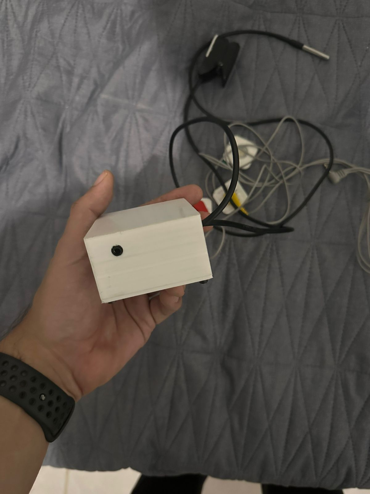
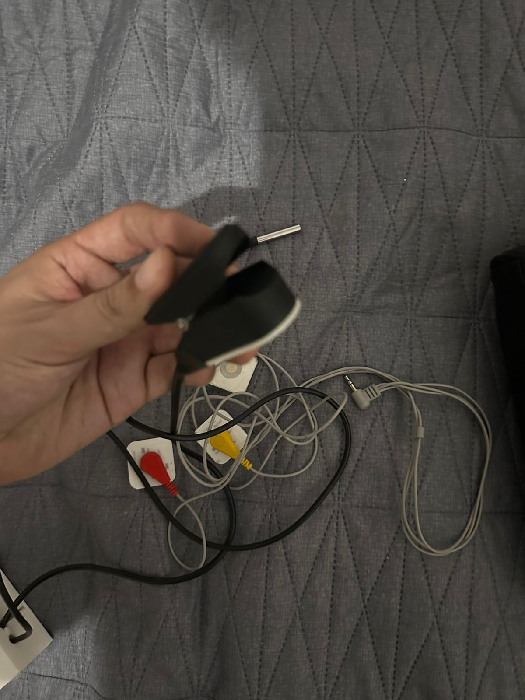
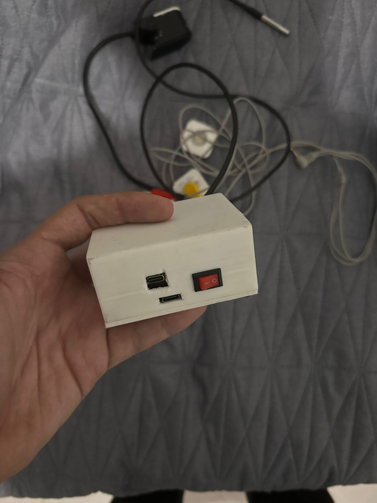
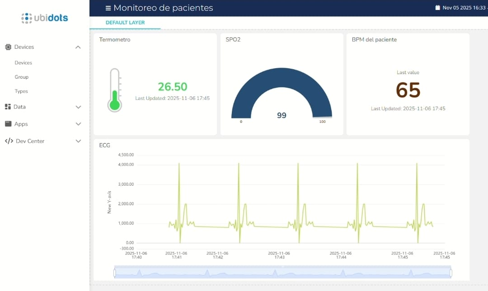
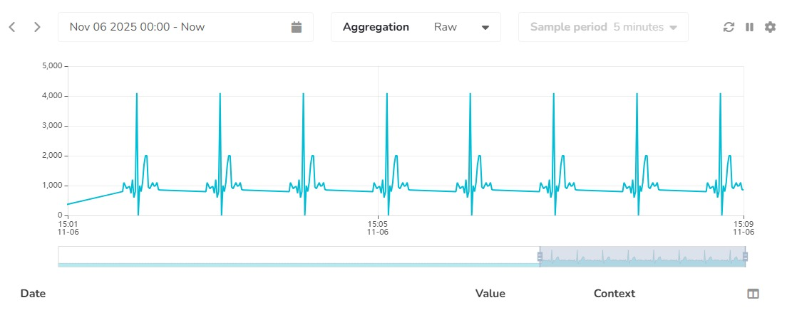

# 🩺 Sistema de Monitorización Remota de Signos Vitales (IoT)

Este repositorio documenta el proyecto "Diseño de un Sistema Embebido Basado en IoT para la Monitorización Remota de Signos Vitales en Pacientes Geriátricos", desarrollado en la Universidad Politécnica de Chiapas.

El sistema emplea un microcontrolador ESP32 para adquirir, procesar y transmitir cuatro signos vitales clave a la plataforma en la nube **Ubidots** a través de **MQTT**.

---

## 📸 Galería del Proyecto

### 1. 📸 Galería del Producto Final

El dispositivo final integra todos los componentes electrónicos (ESP32, sensores, batería) dentro de una carcasa ergonómica impresa en 3D, diseñada para ser un monitor portátil, funcional y fácil de usar.

<p align="center">
  
  
  
  
</p>

### 2. Visualización de Datos (Dashboard Ubidots)

Los datos se envían en tiempo real a Ubidots para su monitorización remota por personal médico o cuidadores.

<table align="center" style="border: none;">
  <tr style="border: none;">
    <td align="center">
      <b>Dashboard Principal (SpO2, BPM, Temp)</b><br>
      
    </td>
    <td align="center">
      <b>Señal de ECG en Tiempo Real</b><br>
      
    </td>
  </tr>
</table>

---

## 🛠️ Stack Tecnológico

| Categoría | Componente / Tecnología |
| :--- | :--- |
| **Microcontrolador** | ESP32 |
| **Plataforma IoT** | Ubidots (Broker MQTT y Dashboard) |
| **Comunicación** | WiFi y Protocolo MQTT |
| **Sensor ECG** | Módulo AD8232 |
| **Sensor Oximetría/Pulso**| Módulo MAX30102 |
| **Sensor Temperatura** | Sensor DS18B20 (sumergible) |
| **Firmware** | C++ (Arduino IDE) |

---

## 🚀 Guía de Inicio Rápido

El código fuente para el ESP32 se encuentra en la carpeta `/firmware`.

### 1. Librerías Requeridas (Arduino IDE)
Asegúrate de tener instaladas las siguientes librerías a través del Gestor de Librerías:
* `PubSubClient` (para MQTT)
* `Ubidots` (por Ubidots)
* `OneWire` (para el DS18B20)
* `DallasTemperature` (para el DS18B20)
* `MAX30105` (Librería de SparkFun para el MAX30102)

### 2. Configuración de Credenciales
Antes de compilar, abre el archivo `.ino` y modifica las siguientes variables con tus datos:

```cpp
// -- Configuración WiFi --
const char* WIFI_SSID = "NOMBRE_DE_TU_WIFI";
const char* WIFI_PASS = "PASSWORD_DE_TU_WIFI";

// -- Configuración Ubidots --
const char* UBIDOTS_TOKEN = "TU_TOKEN_DE_UBIDOTS";
const char* DEVICE_LABEL = "esp32"; // O el nombre de tu dispositivo
```

## 📄 Publicación Académica

Este proyecto ha sido documentado en la revista *Tecnología Digital*.  
El documento completo también se encuentra disponible en la carpeta `docs` de este repositorio:

<p align="center">
  <a href="docs/articulo_signos_vitales_iot.pdf" target="_blank">
    
    <br><em>Diseño de un sistema embebido basado en IoT para la monitorización remota de signos vitales en pacientes geriátricos</em>
  </a>
</p>

<p align="center">
  <a href="https://www.revistatecnologiadigital.com/pdf/15_03_003_diseno_sistema_embebido_IoT_monitorizacion_remota_signos_geriatricos.pdf" target="_blank">
    📎 <em>Acceso al artículo original en la revista Tecnología Digital</em>
  </a>
</p>

